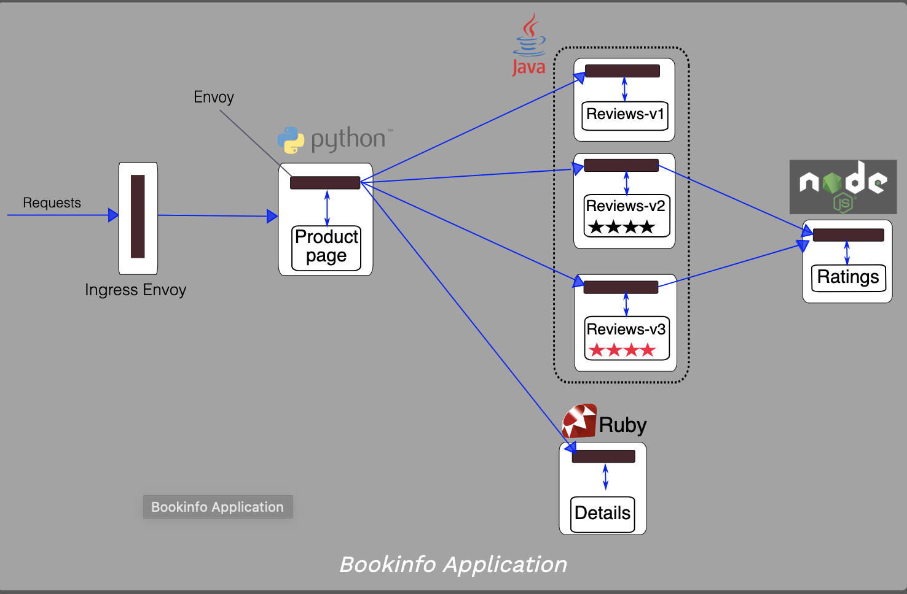

# Literature Review

# INDUSTRIAL IMPLEMENTATIONS OF DISTRIBUTED TRACING

## Istio

Istio is an open platform-independent service mesh that provides traffic management, policy enforcement, and telemetry collection. It's robust tracing, monitoring, and logging features gives deep insights into the service mesh deployment.

>The term service mesh is used to describe the network of microservices that make up applications and the interactions between them.

### Distributed Traces - Istio

https://istio.io/docs/concepts/observability/#distributed-traces

Istio generates distributed trace spans for each deployed service, providing a detailed understanding of call flows and service dependencies within a mesh.

Istio supports distributed tracing through the Envoy proxies. The proxies automatically generate trace spans on behalf of the applications they proxy, requiring only that the applications forward the appropriate request context.

>Envoy Proxy is a modern, high performance, small footprint edge and service proxy.

Istio supports a number of tracing backends, including Zipkin, Jaeger, LightStep, and Datadog. Operators control the sampling rate for trace generation (that is, the rate at which tracing data is generated per request). This allows operators to control the amount and rate of tracing data being produced for their mesh.

#### How does distributed tracing work in Istio? 

https://istio.io/faq/distributed-tracing/ 

Istio integrates with distributed tracing systems in two different ways: 

1. Envoy-based  
2. Mixer-based tracing integrations.

For both tracing integration approaches, applications are responsible for forwarding tracing headers for subsequent outgoing requests.

In particular, Istio relies on applications to propagate the B3 trace headers, as well as the Envoy-generated request ID. 

> B3 Propagation is a specification for the header "b3" and those that start with "x-b3-". These headers are used for trace context propagation across service boundaries.

These headers include:
x-request-id
x-b3-traceid
x-b3-spanId
x-b3-parentspanid
x-b3-sampled
x-b3-flags
b3

#### HOW DOES ENVOY-BASED TRACING WORK?

For Envoy-based tracing integrations, Envoy (the sidecar proxy) sends tracing information directly to tracing backends on behalf of the applications being proxied.

EXAMPLE
https://istio.io/docs/examples/bookinfo/
> Envoy sidecars are injected along side each service.

#### HOW DOES MIXER-BASED TRACING WORK?
For Mixer-based tracing integrations, Mixer (addressed through the istio-telemetry service) provides the integration with tracing backends. The Mixer integration allows additional levels of operator control of the distributed tracing, including fine-grained selection of the data included in trace spans. It also provides the ability to send traces to backends not supported by Envoy directly.

# Frontend Design

Implemented React and Redux to develop frontend. Redux helps to manage the application data storage at one place.

Implemented Redux Thunk Middleware to handle requesting data from the backend.

Developed the frontend UI using Material UI framework for React.

Implemented Component Diagram using MxGraph-js library to trace the Request ID.

react-sequence-diagram to display interactive component and sequence diagram to trace the application.
